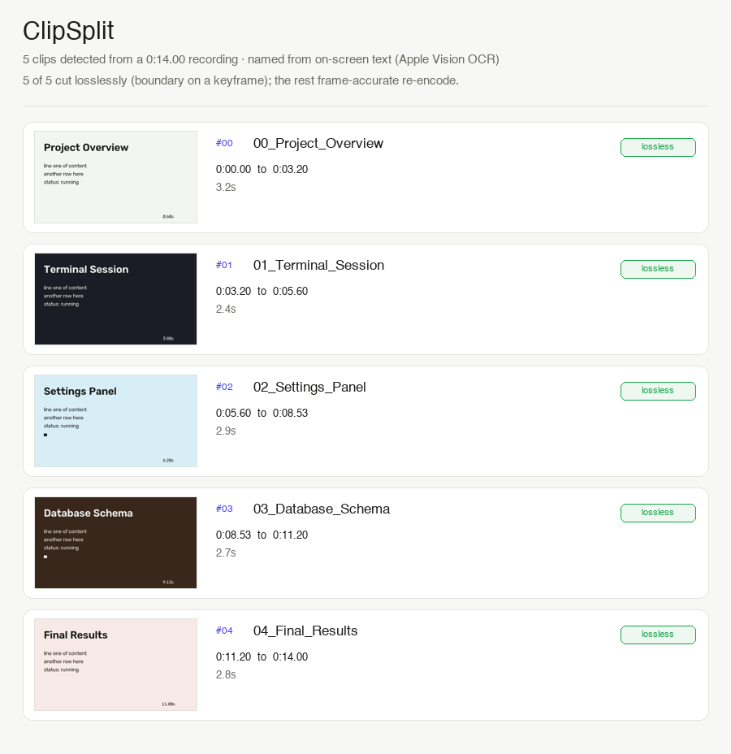

# ClipSplit

**Point it at a screen recording. It finds where the content changes, splits the video into clips at those cuts, and names each clip from the text on screen. Review, rename, export. 100% on your machine.**

You record a 12-minute walkthrough: an app, then a terminal, then a slide deck, then a browser. Now you want four clean clips, each named for what it shows, not `Screen Recording 2026-07-06 at 4.11.02 PM (3).mov`. ClipSplit watches the recording for the moments the whole screen turns over, cuts there, OCRs the most prominent line at each cut, and hands you `01_Terminal_Session.mp4`, `02_Database_Schema.mp4`, and so on.



Above: a real run on the synthetic demo. Five scene changes found, each clip named from its on-screen heading. The export report shows every clip cut losslessly.

## The 100% local guarantee

Nothing you process leaves your machine. There is no cloud, no upload, no telemetry, no network call anywhere in the detect / split / name path. OCR is **Apple Vision**, which runs entirely on-device. Scene detection is OpenCV in-process. Cutting uses a **static ffmpeg binary bundled inside the `imageio-ffmpeg` wheel** (there is no system ffmpeg on this machine), invoked as a local subprocess.

This is backed by a test: [`tests/test_no_network.py`](tests/test_no_network.py) installs a guard that raises if any Python socket is opened, then runs a full analysis (detect + OCR naming) over the synthetic recording. If any dependency in that path tried to phone home, the test fails. It passes. One caveat, same as any Apple-Vision tool: OCR runs in a separate on-device system process, so its work happens outside this Python process and the socket guard cannot observe it. Apple documents Vision as fully on-device; the test covers everything on the Python side.

## What it does

1. **Score the recording over time.** Walk the video at 4 analyzed frames per second (downscaled to 160×90 first, so it is fast). For each consecutive pair compute a change score that blends two signals: the fraction of pixels that moved meaningfully (a big region turning over) and the distance between the two frames' grayscale histograms (a tone/layout flip that scrolling text would confuse). A blinking cursor or moving mouse barely moves the score; an app switch or slide flip spikes it near 1.0.
2. **Find the boundaries.** Mark a cut where the score is a local peak that clears a **robust** threshold (see the hard part below), then enforce a minimum clip length so one busy transition does not shatter into ten slivers.
3. **Name each clip.** Grab a frame a little way *into* each clip (not the first frame, which can be mid-transition), OCR it with Apple Vision, and pick the most *title-like* line: mostly by glyph height, with a nudge for high confidence and top-of-frame position and a penalty for paragraph-length lines. Sanitize it to a filename; fall back to `clip_{index}_{mm-ss}` when OCR finds nothing usable.
4. **Review** in a local Gradio UI: each clip as a thumbnail with start/end timecodes, duration, and an editable name, plus a keep/skip toggle.
5. **Export** the clips you want to a folder (lossless where possible, see below), each an independent, playable file with audio preserved.

## The genuinely hard part: cutting losslessly lands on keyframes, not on your boundary

Cutting a video *losslessly* means `-c copy`: copy the already-encoded packets straight through, no re-encode, so it is fast and bit-for-bit identical. But H.264/HEVC packets depend on earlier frames, so a decoder can only **start** playback from a keyframe (I-frame). ffmpeg with `-c copy` therefore snaps a cut back to the nearest keyframe at or before your requested start. In a screen recording keyframes are often 2–10 seconds apart, so a stream-copy cut can drift by seconds. For an auto-splitter that is a real bug: the clip would begin in the middle of the *previous* scene.

ClipSplit handles this **per clip**:

1. It asks ffmpeg where the keyframes actually are (decoding only keyframes via `-skip_frame nokey` + `showinfo`, which prints each keyframe's `pts_time`).
2. **If a keyframe sits within a small tolerance (0.25s) of the clip's start**, the boundary effectively *is* on a keyframe: stream-copy it. Lossless, fast, audio copied through.
3. **If the boundary falls between keyframes**, a stream copy would drift, so that clip only is **re-encoded** (`libx264 -crf 18`, AAC audio). Re-encoding lets ffmpeg place a fresh keyframe exactly at the cut for a frame-accurate start. It is slower and not bit-identical, but it is the correct trade for an accurate boundary.

So the split is lossless wherever the cut happens to align with a keyframe and frame-accurate everywhere else, and the export report tells you which path each clip took. See [`clipsplit/export.py`](clipsplit/export.py); the branch is exercised directly by [`tests/test_export.py`](tests/test_export.py) (`test_between_keyframe_boundary_reencodes`, `test_on_keyframe_boundary_copies`).

There is a happy accident on real QuickTime screen recordings: macOS tends to insert a keyframe *at* a scene change (the frame is entirely new, so the encoder has nothing to predict from). That means most real boundaries land on a keyframe and take the lossless path, exactly the case ClipSplit optimizes for.

## The other hard part: a robust threshold, or you miss every cut

The obvious threshold is `mean + k·std` of the score series. It fails badly here, and the failure is instructive. The boundary spikes are the *only* large values in an otherwise near-zero series, so they dominate the standard deviation and push `mean + k·std` **above the spikes themselves**. On the demo, that threshold came out at 1.12 while the real cuts peak at 0.99, so it found **zero** boundaries.

The fix is to describe the *quiet background between cuts*, not the whole series. ClipSplit uses `median + z·MAD` (median absolute deviation, scaled by 1.4826 so `z` reads in familiar sigma units). The median and MAD ignore a handful of large outliers by construction, so the threshold sits just above the noise floor and the spikes clear it easily. See [`clipsplit/detect.py`](clipsplit/detect.py), `find_boundaries`.

## Validation (real numbers)

Detection has no ground truth on a real recording, so `validate.py` renders its own: a synthetic screen recording whose scenes switch at **known timestamps** with **known headings** (including a hard light-screen-to-light-screen transition and a short 2-second scene), then measures boundary precision/recall, timing error, and how many headings OCR recovered into the auto-names.

Run `./venv/bin/python validate.py`. Latest run:

```
video: validation.mp4  (15.0s, 6 scenes, fps=30)
planted boundaries: [3.0, 5.5, 7.5, 10.0, 12.0]
detected boundaries:[3.2, 5.6, 7.73, 10.13, 12.0]
------------------------------------------------------------------------------
true positives                   5
false negatives                  0
false positives                  0
recall                        1.00
precision                     1.00
mean timing error (s)        0.133
max timing error (s)         0.233  (tolerance 0.4s)
------------------------------------------------------------------------------
clips produced: 6 (expected 6)
headings recovered by OCR into names: 6/6 (100%)
RESULT: PASS
```

Every planted cut found, no spurious cuts, timing within a quarter second (the 4fps sampling granularity), and every scene heading recovered into a clip name.

The timing error is honest: at 4 analyzed fps a boundary can be reported up to ~0.25s late. That is fine for splitting (the next scene's first quarter-second is near-identical to the frame that triggered the cut), and the lossless keyframe-snap absorbs it. Raise `sample_fps` in `DetectParams` for tighter timing at the cost of speed.

## Run it

```bash
# uv is at ~/.local/bin/uv on this machine; there is no system python/brew.
export PATH="$HOME/.local/bin:$PATH"

uv venv --python 3.12 venv
VIRTUAL_ENV=venv uv pip install -r requirements.txt   # macOS only: Apple Vision + ocrmac

# 1. generate the synthetic demo recording
./venv/bin/python make_demo.py

# 2. see the real validation numbers
./venv/bin/python validate.py

# 3. run the tests (includes the no-network guarantee)
./venv/bin/python -m pytest tests/ -q

# 4. launch the local review UI (127.0.0.1 only, never shared, no auto-open)
./venv/bin/python app.py                          # then open http://127.0.0.1:7860
./venv/bin/python app.py synthetic_out/demo.mp4   # or prefill the demo video
```

**Split your own recording.** Paste the path to any QuickTime `.mov` or `.mp4` screen recording into the UI and click *Detect clips*. Your video is read locally and never copied or uploaded.

Requires macOS (Apple Vision). Built and validated on Python 3.12.

## Project layout

- `clipsplit/detect.py` — scene-change scoring and the robust boundary finder. The core.
- `clipsplit/naming.py` — Apple Vision OCR of a clip frame, prominence scoring, filename sanitization.
- `clipsplit/export.py` — the lossless-copy vs frame-accurate-re-encode cutting logic.
- `clipsplit/video.py` — OpenCV metadata + the bundled static ffmpeg (keyframe probe, cutting).
- `clipsplit/pipeline.py` — orchestration: video path → named clips.
- `clipsplit/synthgen.py` — synthetic recording + ground-truth generator (test-only; the detector never imports it).
- `app.py` — local Gradio review UI.
- `validate.py` — boundary precision/recall harness (the numbers above).
- `tests/` — detection, export (both cut branches), naming, and the no-network test.

## Limitations and deferred work

- **A slow cross-fade between scenes** spreads the change over many frames, so no single frame-pair spikes hard. ClipSplit is tuned for the hard cuts that dominate real screen recordings (app switches, slide flips, navigation jumps); a long dissolve can be missed or split late. A cumulative-drift detector would catch these and is deferred.
- **Timing is quantized to the analysis rate** (4fps by default). Fine for splitting; raise `sample_fps` for tighter cuts.
- **Naming is only as good as the OCR.** A scene with no prominent text, or a stylized/low-contrast heading Apple Vision misreads, falls back to a `clip_NN_mm-ss` timecode name. That is a safe default, not a failure.
- **Between-keyframe boundaries are re-encoded**, so those clips are not bit-identical to the source (documented above). On real recordings most boundaries land on a keyframe and stay lossless.
- **macOS only** for OCR (Apple Vision). Detection and cutting are cross-platform, but naming needs Vision.
